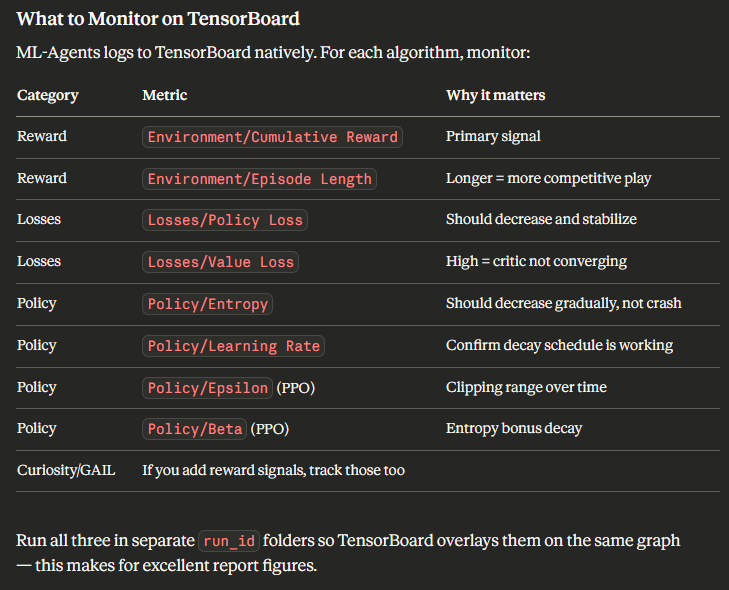

## The Algorithms that we can run for soccer twos game

- As we are approaching semester end, we have less time to build algorithms like TRPO and A2C from scratch
- It is best that we use native (unity) support algorithms which are in ml-agents github repository
- The current `PPO algoithm` is picture perfect and we use this as one of the algorithms that we use for comparision
- Second algorithm is `SAC (Soft Actor-Critic)` (https://github.com/Unity-Technologies/ml-agents/tree/develop/ml-agents/mlagents/trainers/sac)
- We have the implementation of this ready, so its no bigge to run this for soccer twos
- Final algorithm (what chatgpt suggested was) `a variant of PPO algorithm`

Chatgpt suggested to run a ppo code without the entropy, different epsilon, no GAE (λ = 1 or 0), shared critic vs separate
This is suggested to involve our contribution of building a low end algorithm to test on soccer twos

- if the above idea is not viable and good enough, we can opt for `MA-POCA (Multi-Agent POsthumous Credit Assignment) algorithm`
- It is also present in the ml-agents github repository (https://github.com/Unity-Technologies/ml-agents/tree/develop/ml-agents/mlagents/trainers/poca)

- The question that i wanna ask my teammates is, `Should we really run algorithms that are not taught or not provided in the project objectives?`
- `What happens if he asks any thing related to the algorithms that we just implemented during the project demo?`

- If no, then the current ppo algorithm can be run and others can be discarded
- If yes, then we will decide whichever of these three is comfortable for us

## Performance Metrics that we need to make a note of, for comparision report later

#### Training & Stability
- Cumulative reward overtime (smoothed) - It can be for per episode or per team
- Policy loss and value loss curves
- Entropy (exploration behavior) (how exploratory the agent remains — important for a competitive game)
- Reward variance across episodes
- Standard deviation across multiple runs

#### Sample Efficiency
- Reward achieved per million environment steps — who learns faster?
- Steps to first consistent win
- Steps to reach reward threshold
- Episode length (time to goal) - How fast goals happen

#### Final Performance
Game-specific metrics:
- Win Rate (% matches won by team) in head-to-head evaluation across all three trained models
- Goal Difference - Goals Scored - Goals Conceded
- Draw Rate - Number of matches drawn (because of time limit) / total number of matches

#### Multi-Agent Metrics (VERY IMPORTANT for MA-POCA)
- Group cumulative reward
- Individual vs team reward correlation
- Coordination effectiveness (qualitative or measured)

#### Comparative Analysis
PPO vs SAC vs MA-POCA:
- Convergence speed
- Stability
- Final performance
- Cooperation ability

- We need to ask gpt to provide us .py code for all these performance evaluations

## Tensorboard Monitoring

I know very less about tensorboard hence i pasted what gpt provided me. 
We can use any if the laptops to monitor because the url can be publicized via ngrok